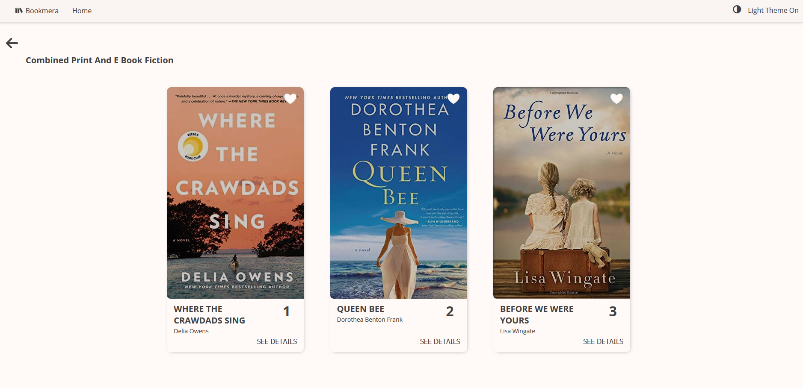

# Bookmera

This is a NY Times current best-seller books that allows you to browse through the different categories and see which are the most renowned. The data is fetched realtime from the NY Times Books API. It has an "Infinite Scrolling" which loads only the items you are currently viewing, and in the background gets the next batch.

You can also "like" 👍 the books, and purchase them by navigating to Amazon, Barnes and Noble or your local store from within the app.

This is an in-progress-pwa done with Create-React-App v3 (CRA) - React V16.8 (With Hooks), Sass, styled-components, TypeScript, Jest, Immutable, and IndexedDB.

No CSS framework was used in developing this application. Icons were grabbed from icomoon, and the Open Sans font from Google Fonts.

# Features

1. See the top current NY Times books, and purchase them directly from Amazon, Barnes and Noble or Locally (Later one doesn't always work).
2. Has an infinite scrolling mechanism which loads books each 6 or 3 entries (Desktop, and mobile respectively).
3. When you tap or click on a specified book, a modal shows up with the picture on the left. The picture becomes vertical when on mobile.
4. 24 hours query cache stored in IndexedDB (Can be accessed by a ServiceWorker);

5. Uses CSS Grid to display an adaptive 3-to-1 column (Desktop to mobile respectively) layout which shows the images.
6. You are able to switch between a light and a dark theme on the fly.
7. Responsive design that targets any device screen.
8. Modal pop up to see the best seller from the list, which responsively adapts itself according to the viewport.
9. Tests for the infinite scrolling and loading.
10. All user data is persisted locally.
11. Uses React Hooks, Styled-Components (With Theming) and TypeScript.

# Notes

Currently the API has some limitations:

1. There's barely any control on the items returned. The first API call returns all the items, while the subsequent ones are returned in pair of 20s.
2. Images are one-size-fits-all, meaning that there's no way to optimize the images for smaller or bigger pixel density screens. They are currently served realtime.
3. You can find an Adobe XD file with a previous design and several iterations in root.

# Further enhancements

Due to time constraints the following features and optimizations weren't performed. If the project were to continue these would be the next areas to work on.

1. Offline capabilities with Service Workers, either using the built-in CRA SW file. Intercept all the outgoing fetch requests and return them from cache.
2. Replace the main page images with individual ones. The API has a limitation which only returns you the name in which you can later fetch the best seller books. An original plan was to recursively fetch for all the books, but that would've hit the system pretty hard. In the worst case scenario that would've conveyed making 55 independent API calls. Had to look for a better way on how to handle that.
3. Tests: Integration and End-to-End tests to test the critical parts of the system.
4. Add a notification widget with "liked" books that lets you see which are the books the user liked.
5. Grab the price from Amazon. This wasn't performed as Amazon's Product API required a tedious sign-up process through their associates program.
6. Perform an Audit with Google Lighthouse after the project has been built for production.
7. Image preloading in the Infinite Scrolling. The items that need to be displayed
8. React-virtualized for massive lists. This wasn't a priority since there were 15 element tops, and the browser handled it pretty well.
9. A search feature to filter the Best Seller Categories.

# Known Bugs

1. There's a small gap on the bottom of the image from the modal.
2. Dark theme doesn't persist between refreshes.
3. There are some cards that present a scroll when the title is too long (This can be fixed with the width + text-overflow: ellipsis).
4. There are book covers that do not adapt itself to the card's size. This can be fixed by making it a background-image and applying the cover in the background-size.
5. The bottom in dark mode still displays white.
6. There's a FOUC (Flash of Unstyled Content) when transitioning from the main page to the best-seller page in dark mode. (This can be fixed by setting the upper parent as dark. It would probably need some app restructuring).
7. The API key is hardcoded into the config file (config.ts). This needs to be moved to the environment variable (at least). This is bad practice as they shouldn't even be in the repo in the first place.
8. There are cards that present invariable heights. This can be fixed with the same mechanism as #4 (Another advantage is that introduces parallelism even in HTTP/1.1)
9. Edge <=15 doesn't support coloring emoji.It shows all the hearts in red.

## How to Run the project

### To start, in the projet directory:

1. Copy .env.example and rename it to .env in the root.
2. Add the NY Times API key
3. run `npm start` or `yarn start`

Open [http://localhost:3000](http://localhost:3000) to view it in the browser.

The page will reload if you make edits. 
You will also see any lint errors in the console.

### To run unit tests, you can:

1. Run `npm test` or `yarn test`

Launches the test runner in the interactive watch mode. 
Tests are located under [`src/__tests__`](src/__tests__)

###Default README below:

### `npm run build`

Builds the app for production to the `build` folder. 
It correctly bundles React in production mode and optimizes the build for the best performance.

The build is minified and the filenames include the hashes. 
Your app is ready to be deployed!

See the section about [deployment](https://facebook.github.io/create-react-app/docs/deployment) for more information.

### `npm run eject`

**Note: this is a one-way operation. Once you `eject`, you can’t go back!**

If you aren’t satisfied with the build tool and configuration choices, you can `eject` at any time. This command will remove the single build dependency from your project.

Instead, it will copy all the configuration files and the transitive dependencies (Webpack, Babel, ESLint, etc) right into your project so you have full control over them. All of the commands except `eject` will still work, but they will point to the copied scripts so you can tweak them. At this point you’re on your own.

You don’t have to ever use `eject`. The curated feature set is suitable for small and middle deployments, and you shouldn’t feel obligated to use this feature. However we understand that this tool wouldn’t be useful if you couldn’t customize it when you are ready for it.

## Learn More

You can learn more in the [Create React App documentation](https://facebook.github.io/create-react-app/docs/getting-started).

To learn React, check out the [React documentation](https://reactjs.org/).

### Code Splitting

This section has moved here: https://facebook.github.io/create-react-app/docs/code-splitting

### Analyzing the Bundle Size

This section has moved here: https://facebook.github.io/create-react-app/docs/analyzing-the-bundle-size

### Making a Progressive Web App

This section has moved here: https://facebook.github.io/create-react-app/docs/making-a-progressive-web-app

### Advanced Configuration

This section has moved here: https://facebook.github.io/create-react-app/docs/advanced-configuration

### Deployment

This section has moved here: https://facebook.github.io/create-react-app/docs/deployment

### `npm run build` fails to minify

This section has moved here: https://facebook.github.io/create-react-app/docs/troubleshooting#npm-run-build-fails-to-minify
